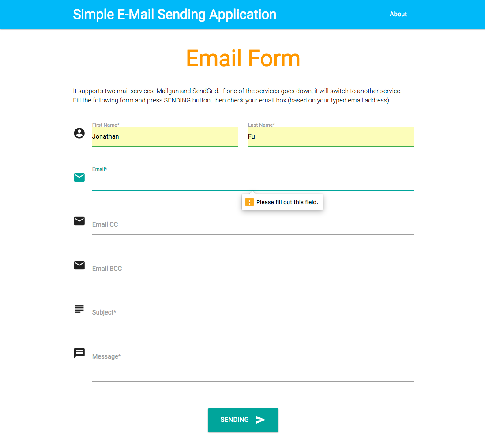

## Simple Email Sending Application
This application supports both mail services: Mailgun and SendGrid.

## This project uses Materializecss (Front-End) and NodeJS (Back-End).

Run `npm install` to install dependencies.

## Update API credentials for your mail providers

Change to your API KEYS in the `config.js` file.

    MAILGUN: {
        API_KEY: 'key-8abc39091bf7ea0a4517e899d594cDummy',
        DOMAIN: 'www.mydomain.com'
    },

    SENDGRID: {
        API_KEY: 'SG.w8aZzAcFTzOExM4o5zvgnA.TgNhsmCRdOw6pq7ipma_t9nyn5sgxhbwoBeUjAYnDummy',
        PATH: '/v3/mail/send'
    }

## Start Server
Run `npm start` to start service, then go to `http://localhost:3000/` to check it.
Below is the Email Form.

